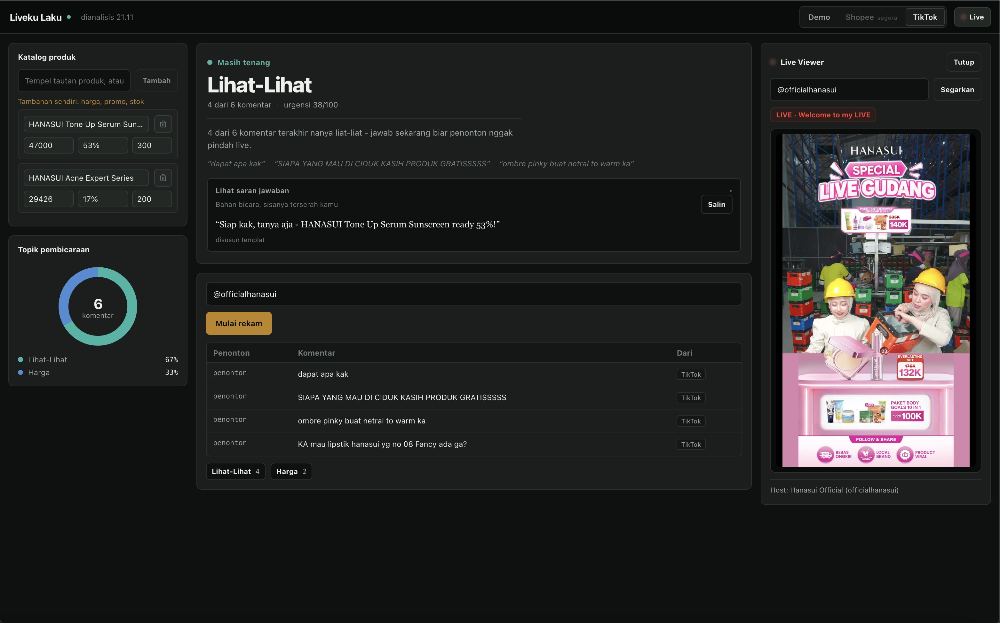
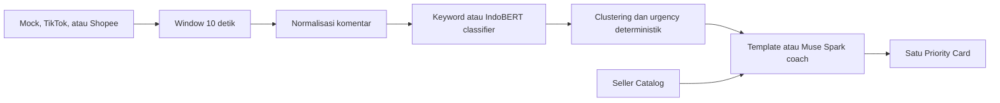

# Liveku Laku

> Dari Flood komentar menjadi satu keputusan yang bisa langsung diucapkan host.

Liveku Laku adalah copilot untuk host live-commerce di TikTok dan Shopee. Dalam satu **Window** berdurasi 10 detik, Liveku Laku mengelompokkan komentar yang masuk, menghitung urgensi secara deterministik, lalu menyajikan tepat satu **Priority Card**: topik yang perlu dijawab sekarang, alasan mengapa topik itu penting, dan saran jawaban yang grounded pada katalog seller.

**COMPFEST 18 AIC - AI for the Backbone of the Economy - Smart Commerce**



## Masalah yang kami selesaikan

Perdagangan digital sudah menjadi bagian penting dari ekonomi Indonesia. [Statistik E-Commerce 2023 dari Badan Pusat Statistik](https://www.bps.go.id/id/publication/2025/01/30/d52af11843aee401403ecfa6/statistik-e-commerce-2023.html) memperkirakan terdapat 3.816.750 usaha e-commerce pada 2023. Mayoritas merupakan usaha mikro dan kecil, sektor ini menyerap sekitar 12,4 juta tenaga kerja, dan 95,33 persen usaha menggunakan pesan instan sebagai media penjualan.

Live commerce membawa interaksi digital itu ke tempo real-time. Ketika pertanyaan harga, ongkir, stok, COD, garansi, dan checkout datang bersamaan dengan sapaan serta komentar lain, perhatian host menjadi bottleneck. Host harus memilih apa yang perlu dijawab sambil tetap mempresentasikan produk dan menjaga ritme siaran.

Liveku Laku tidak membuat antrean rekomendasi baru. Setiap Window menghasilkan satu tindakan yang jelas:

- **Apa yang perlu dijawab:** cluster komentar dengan prioritas tertinggi.
- **Seberapa mendesak:** skor urgency 0 sampai 100 yang dihitung secara deterministik.
- **Mengapa sekarang:** bukti berupa jumlah, proporsi, dan sampel komentar.
- **Apa yang dapat dikatakan:** saran singkat yang menggunakan Seller Catalog tanpa mengarang fakta produk.

Keputusan akhir tetap berada di tangan host. Prinsipnya sederhana: **one Window, one Priority Card, one next action.**

## Fitur utama

- Demo Flood yang berjalan lokal tanpa API key dan tanpa koneksi provider.
- Analisis sinkron untuk satu Window komentar melalui `POST /analyze`.
- Tujuh intent live-commerce: `harga`, `bandingkan_harga`, `ongkir`, `cod`, `garansi`, `stok`, dan `checkout`, dengan `browse` sebagai fallback.
- Seller Catalog yang disimpan selama sesi di browser dan dikirim bersama setiap permintaan analisis.
- Parser stateless untuk tautan atau share-text produk melalui `POST /catalog/parse`.
- Priority Card topic-first dengan cluster pendukung, urgency, `why_now`, dan saran jawaban opsional.
- Template deterministik sebagai fallback ketika layanan AI eksternal tidak tersedia.
- Mode live opsional untuk TikTok dan Shopee ketika konfigurasi provider tersedia.

## Cara kerja



Pipeline utama bersifat sinkron dan stateless. Frontend mengirim satu Window, backend mengklasifikasikan dan mengagregasikan komentar, lalu coach menyusun jawaban yang grounded. Tidak ada database, background worker, riwayat analisis, atau retraining saat demo.

## Menjalankan secara lokal

### Prasyarat

Pastikan perangkat memiliki:

- [Git](https://git-scm.com/downloads)
- [Docker Desktop](https://www.docker.com/products/docker-desktop/) atau Docker Engine dengan Compose v2
- Port `3000` dan `8000` yang tersedia

API key tidak diperlukan untuk menjalankan alur demo utama.

### 1. Clone repository

```bash
git clone https://github.com/pablonification/livelaku.git
cd livelaku
```

### 2. Siapkan konfigurasi

```bash
cp .env.example .env
```

Konfigurasi bawaan menggunakan mode Mock, keyword classifier, dan coach deterministik. Biarkan nilai API key kosong untuk pengujian offline.

### 3. Build dan jalankan aplikasi

```bash
docker compose up --build
```

Build pertama dapat memerlukan beberapa menit. Tunggu hingga service `backend` dinyatakan sehat dan frontend selesai dijalankan, lalu buka:

| Layanan | Alamat |
|---|---|
| Aplikasi Liveku Laku | <http://localhost:3000> |
| Dokumentasi interaktif API | <http://localhost:8000/docs> |
| Health check backend | <http://localhost:8000/api/health> |

### 4. Jalankan demo utama

Di <http://localhost:3000>:

1. Pastikan sumber **Demo** terpilih.
2. Opsional: tambahkan produk melalui panel **Katalog produk** agar saran jawaban menggunakan informasi produk tersebut.
3. Klik **Putar demo**.
4. Tunggu satu Window selesai.
5. Periksa Priority Card yang menampilkan topik utama, urgency, alasan prioritas, dan saran jawaban jika tersedia.

Demo memutar Flood dari `frontend/public/demo_comments.jsonl`, mengumpulkannya selama satu Window, dan mengirim satu permintaan sinkron ke backend.

### 5. Verifikasi melalui terminal

Buka terminal kedua saat container masih berjalan.

Periksa kesehatan backend:

```bash
curl -sf http://localhost:8000/api/health
```

Keluaran harus berupa JSON dengan `"ok": true`.

Uji analisis satu Window dengan Seller Catalog:

```bash
curl -s -X POST http://localhost:8000/analyze \
  -H "Content-Type: application/json" \
  -d '{
    "source": "mock",
    "window_seconds": 10,
    "products": [
      {
        "name": "Kaos Oversize Hitam",
        "price": "Rp99.000",
        "promo": "gratis ongkir Jawa",
        "stock": 42
      }
    ],
    "comments": [
      {
        "user": "budi_99",
        "text": "kak harga berapa?",
        "platform": "mock"
      },
      {
        "user": "sari",
        "text": "spill harga dong kak",
        "platform": "mock"
      }
    ]
  }'
```

Respons yang valid memuat `top_cluster`, `urgency`, `why_now`, dan `suggested_reply`. Nilai `suggested_reply` dapat berupa `null` ketika tidak ada saran yang cukup grounded.

Uji parser Seller Catalog tanpa jaringan eksternal:

```bash
curl -s -X POST http://localhost:8000/catalog/parse \
  -H "Content-Type: application/json" \
  -d '{
    "text": "Kaos Oversize Hitam Rp99.000, gratis ongkir"
  }'
```

Field yang tidak berhasil ditemukan akan dicantumkan dalam `needs_manual` agar seller dapat melengkapinya sendiri.

## Development mode

Development override mengaktifkan reload backend dan Vite HMR:

```bash
docker compose -f docker-compose.yml -f docker-compose.dev.yml up --build
```

Source backend dan frontend di-mount ke container. Dependency frontend disimpan dalam named volume agar tidak menimpa `node_modules` pada host.

## Konfigurasi opsional

Semua variabel runtime terdokumentasi di `.env.example`. Jalur Mock tetap menjadi jalur yang direkomendasikan untuk evaluasi lokal.

| Variabel | Default | Fungsi |
|---|---|---|
| `MODE` | `mock` | Mode adapter bawaan. |
| `WINDOW_SECONDS` | `10` | Durasi Window agregasi. |
| `DEMO_SPEED` | `1` | Pengali kecepatan demo untuk kebutuhan rekaman. |
| `CLASSIFIER_MODE` | `keyword` | Gunakan `keyword` atau checkpoint `local`. |
| `COACH_PROVIDER` | `auto` | Pilih coach `auto`, `api`, atau `mock`. |
| `META_API_KEY` | kosong | Mengaktifkan Muse Spark ketika tersedia. |
| `TRY_TIKTOK` | `0` | Mengaktifkan percobaan pengambilan komentar TikTok live. |
| `SHOPEE_*` | kosong | Kredensial polling resmi Shopee. |

Contoh mengaktifkan checkpoint IndoBERT yang sudah dibake ke image:

```dotenv
CLASSIFIER_MODE=local
```

Contoh mengaktifkan Muse Spark:

```dotenv
META_API_KEY=your_meta_api_key
COACH_PROVIDER=auto
META_MODEL=muse-spark-1.2-contributor
```

Jika provider coach gagal atau key tidak tersedia, backend kembali ke template deterministik. Mode live juga bersifat opsional dan bergantung pada status sesi, kredensial, serta ketersediaan provider. Kegagalan provider tidak menghalangi penggunaan mode Demo.

## API ringkas

Kontrak yang menjadi source of truth berada di [`contracts/openapi.yaml`](contracts/openapi.yaml). Backend menyediakan rute kanonis tanpa prefiks dan alias `/api/*` yang digunakan frontend.

| Method | Endpoint | Kegunaan |
|---|---|---|
| `GET` | `/api/health` | Memeriksa kesehatan backend dan konfigurasi runtime. |
| `POST` | `/analyze` | Mengubah satu Window menjadi satu Priority Card. |
| `POST` | `/catalog/parse` | Memetakan tautan atau share-text ke field Seller Catalog. |

Payload `POST /analyze` menerima hingga 80 komentar dan 20 produk. Untuk sumber TikTok atau Shopee, frontend dapat mengirim `handle` atau `session_id` dengan `comments: []`; backend mencoba mengambil komentar di dalam request yang sama.

## Arsitektur dan teknologi

| Lapisan | Teknologi | Tanggung jawab |
|---|---|---|
| Frontend | React 19, Vite, Astryx Design System, nginx | Window buffer, Seller Catalog, state UI, dan Priority Card. |
| Backend | FastAPI, Python 3.11, Pydantic | Kontrak API, adapter, klasifikasi, agregasi, dan orchestration. |
| Tier 1 AI | Keyword baseline dan IndoBERT | Klasifikasi intent per komentar. |
| Tier 2 AI | Muse Spark 1.2 contributor atau template fallback | Coaching yang grounded pada katalog dan playbook. |
| Runtime | Docker Compose | Build reproducible dan demo lokal tanpa key. |

### Urgency yang dapat dijelaskan

Urgency tidak ditentukan oleh LLM. Skor 0 sampai 100 dihitung dari dominasi cluster, bobot intent, dan tekanan Flood:

```text
urgency = 100 * (0.5 * share + 0.3 * intent_weight + 0.2 * min(1, total / 60))
```

Dengan pemisahan ini, LLM hanya membantu menyusun bahasa. Cluster, jumlah komentar, dan urgency tetap deterministik dan dapat diaudit.

### Bukti kustomisasi model

Repository menyertakan pipeline fine-tuning IndoBERT berbasis `indobenchmark/indobert-base-p1`, dataset sintetis terstratifikasi sebanyak 800 komentar, checkpoint, training log, dan evaluasi held-out. Hasil yang tercatat:

| Model | Akurasi test sintetis |
|---|---:|
| Keyword baseline | 56,25% |
| IndoBERT fine-tuned | 100,00% |

Angka tersebut hanya menggambarkan frozen synthetic held-out split dan tidak diklaim sebagai akurasi produksi. Sebanyak 80 baris bertanda `review_required` masih membutuhkan human spot-check sebelum tim mengklaim validasi manusia 10 persen. Detail reproduksi tersedia di [`model/training/README.md`](model/training/README.md).

## Struktur repository

```text
.
├── backend/                 FastAPI, adapters, classifier, coach, tests
├── contracts/openapi.yaml   Kontrak API, source of truth
├── data/                    Catalog, playbook, dan demo data yang dibake
├── frontend/                React, Vite, Astryx, dan nginx
├── model/                   Pipeline training dan checkpoint IndoBERT
├── tasks/prelim/            Work contract per ticket
├── CONTEXT.md               Ubiquitous language Liveku Laku
├── PRODUCT.md               Product truth dan constraints
├── DESIGN.md                Design system dan interaction principles
└── docker-compose.yml       Runtime lokal utama
```


## Batasan MVP

Liveku Laku sengaja menjaga scope prelim tetap tajam:

- Tidak ada authentication, database, history page, atau analytics dashboard.
- Tidak ada background worker pada alur `POST /analyze`.
- Tidak ada retraining, auto-tuning, atau feedback loop saat aplikasi berjalan.
- Integrasi live bergantung pada provider dan bukan syarat untuk demo offline.
- Seller Catalog berada di memori browser selama sesi dan tidak disimpan server-side.

## Tim

**XD**

| Anggota | Peran |
|---|---|
| Muhammad Fithra Rizki | Hacker |
| Allodya Qonnita Arofa | Hustler |
| Arqila Surya Putra | Hacker |
| Florecita Natawirya | Hipster |
| Athian Nugraha Muarajuang | Hacker |

## Penggunaan

Repository ini dibuat untuk COMPFEST 18 AIC. Penggunaan dan distribusinya mengikuti ketentuan kompetisi dan hak masing-masing dependency pihak ketiga.
